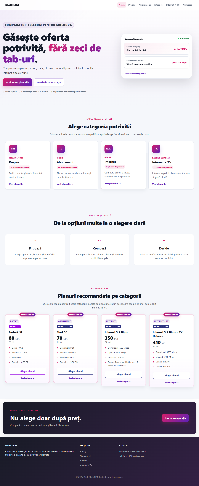
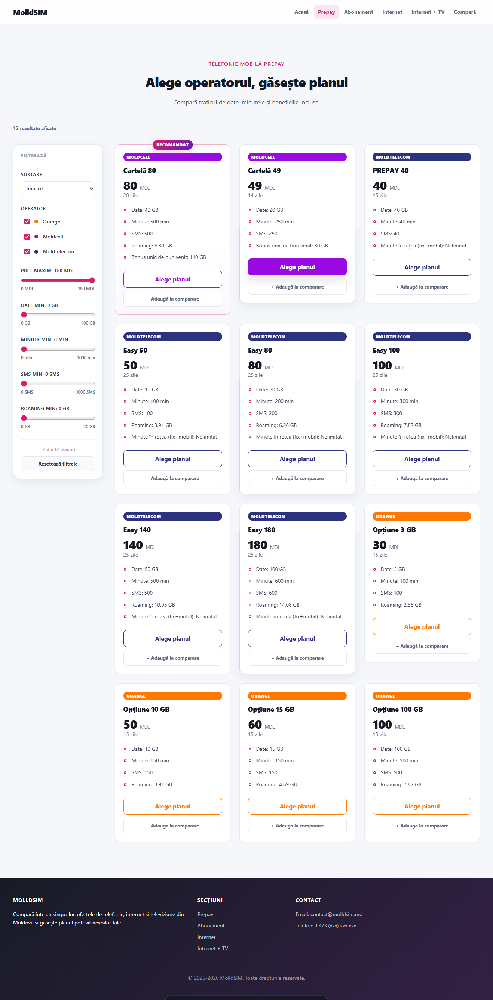
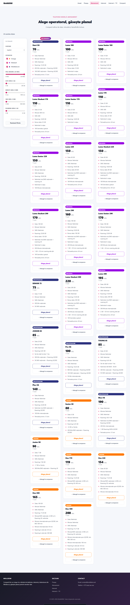
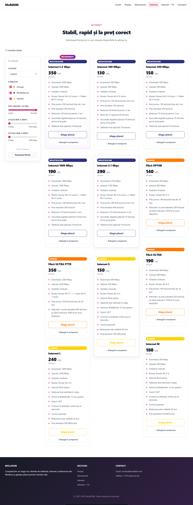
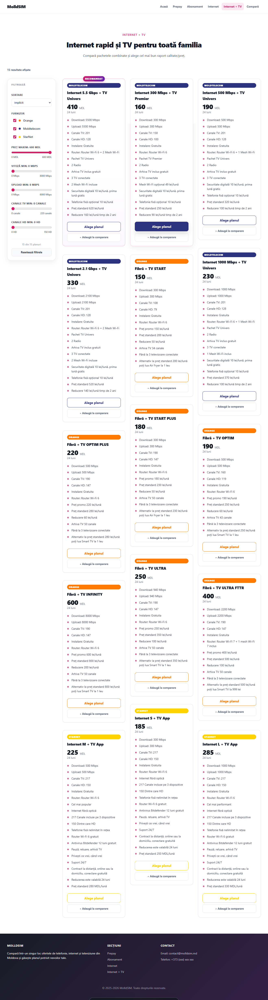
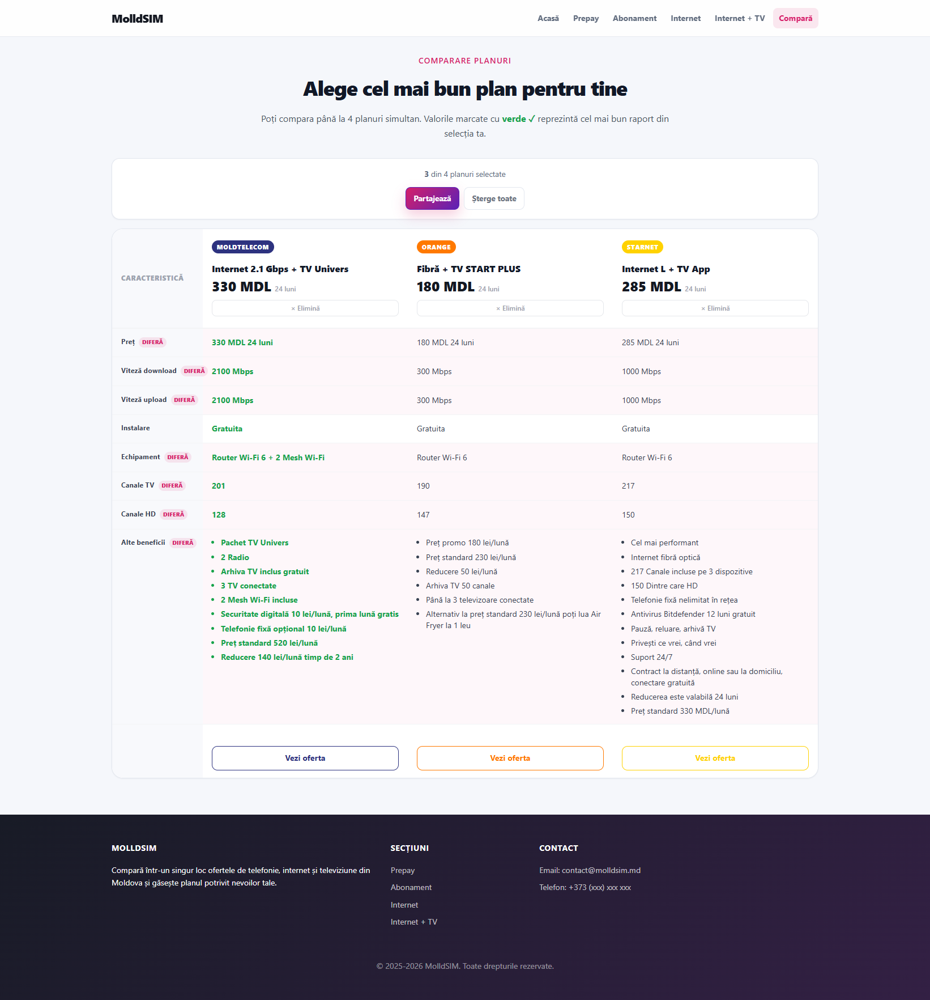
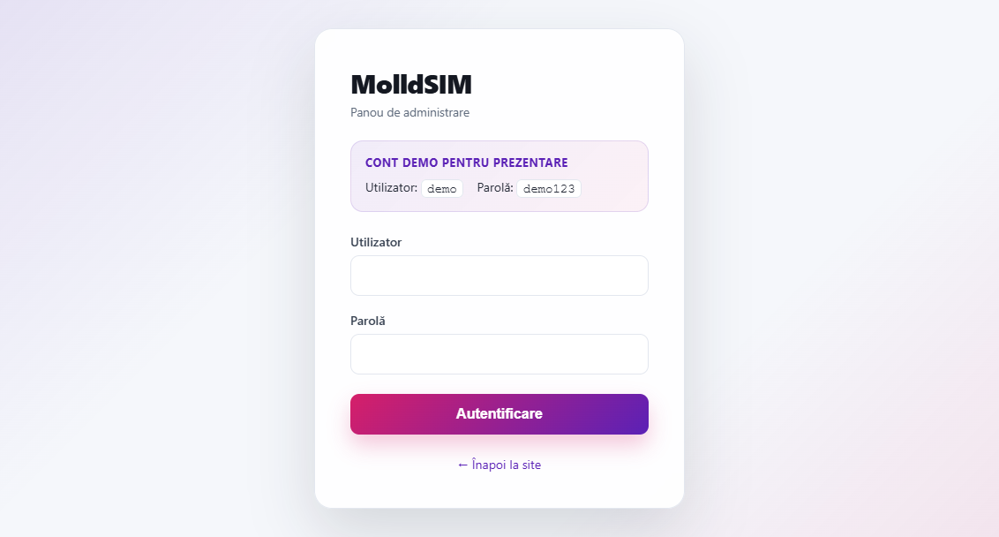
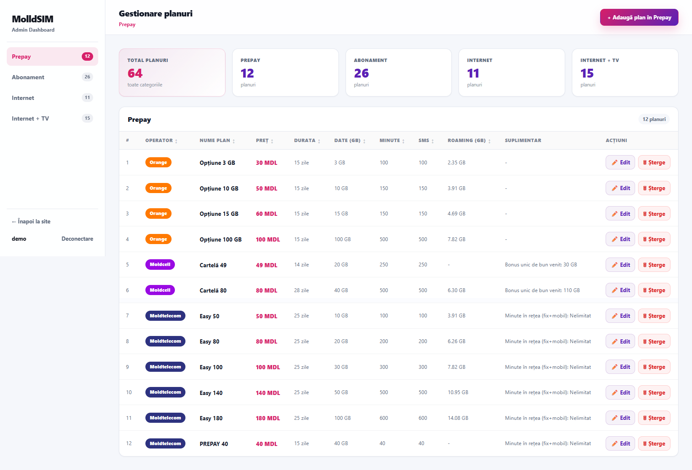

# MolldSIM

MolldSIM este o aplicatie web pentru compararea ofertelor telecom din Republica Moldova. Site-ul ajuta utilizatorii sa gaseasca rapid un plan potrivit pentru telefonie mobila, internet sau Internet + TV, iar administratorul poate gestiona ofertele dintr-un dashboard conectat la baza de date MySQL.

## Pagina principala

Pagina principala prezinta scopul platformei, categoriile disponibile si o selectie de planuri recomandate. Utilizatorul poate ajunge rapid la planurile Prepay, Abonament, Internet sau Internet + TV.


<!--  -->

Pe aceasta pagina utilizatorul poate:

- vedea categoriile principale de servicii telecom;
- accesa rapid listele de planuri;
- vedea cate planuri sunt disponibile pe fiecare categorie;
- deschide pagina de comparatie;
- vedea recomandari generate din planurile disponibile.

## Pagina cu planuri Prepay

Pagina Prepay afiseaza ofertele disponibile pentru cartele si planuri fara abonament lunar. Planurile sunt incarcate din baza de date prin API si pot fi filtrate in timp real.


<!--  -->

Utilizatorul poate:

- filtra planurile dupa operator;
- seta pretul maxim;
- filtra dupa date mobile, minute, SMS si roaming;
- sorta planurile dupa pret sau date incluse;
- deschide oferta operatorului;
- adauga planuri la comparatie.

## Pagina cu abonamente

Pagina Abonament este pentru planurile mobile lunare. Aceasta functioneaza similar cu pagina Prepay, dar este orientata spre oferte cu plata lunara si beneficii recurente.


<!--  -->

Utilizatorul poate compara abonamente dupa:

- pret lunar;
- trafic de internet inclus;
- minute si SMS;
- roaming;
- beneficii suplimentare;
- operator.

## Pagina Internet

Pagina Internet afiseaza ofertele pentru internet fix. Aici sunt importante viteza de download, viteza de upload, pretul si echipamentul inclus.


<!--  -->

Utilizatorul poate:

- compara vitezele de download si upload;
- filtra dupa operator;
- verifica pretul lunar;
- vedea informatii despre router sau instalare;
- adauga ofertele la comparatie.

## Pagina Internet + TV

Pagina Internet + TV afiseaza pachetele complete care includ conexiune la internet si televiziune.


<!--  -->

Planurile pot fi comparate dupa:

- viteza internetului;
- numarul de canale TV;
- numarul de canale HD;
- pret;
- instalare;
- beneficii suplimentare.

## Pagina de comparatie

Pagina de comparatie permite afisarea mai multor planuri intr-un tabel comun. Utilizatorul poate compara direct pretul, beneficiile si caracteristicile tehnice.


<!--  -->

Pagina de comparatie poate:

- compara pana la 4 planuri;
- afisa diferentele dintre oferte;
- evidentia planul cu cel mai bun raport beneficii/pret;
- elimina planuri din comparatie;
- pastra planurile selectate in browser prin `localStorage`;
- oferi link catre pagina operatorului pentru fiecare plan.

## Pagina de login

Pagina de login este folosita pentru accesul in dashboard. Doar utilizatorii autentificati pot crea, edita sau sterge planuri.

<!--  -->


Autentificarea protejeaza:

- accesul la dashboard;
- operatiunile de creare plan;
- operatiunile de editare plan;
- operatiunile de stergere plan.

## Dashboard administrare

Dashboard-ul este zona de administrare a aplicatiei. Aici pot fi gestionate planurile salvate in MySQL.


<!--  -->

Administratorul poate:

- vedea planurile existente;
- adauga planuri noi;
- edita datele unui plan;
- sterge planuri;
- marca un plan ca recomandat;
- gestiona categorii diferite de servicii;
- salva caracteristici suplimentare pentru fiecare oferta.

## Tehnologii folosite

- PHP;
- MySQL;
- JavaScript;
- HTML si CSS;
- XAMPP pentru rulare locala;
- AJAX pentru incarcarea si actualizarea planurilor.

## Structura proiectului

```text
api/                 Endpoint-uri AJAX
css/                 Stiluri CSS
db/                  Conexiune si schema bazei de date
includes/            Layout si functii PHP partajate
pages/               Pagini publice pentru categorii si comparatie
script/              JavaScript pentru filtre, comparatie si meniuri
screenshots/         Capturi de ecran pentru README
dashboard.php        Panou de administrare
index.php            Pagina principala
login.php            Autentificare admin
logout.php           Iesire din cont
```

## Datele aplicatiei

Planurile sunt salvate in MySQL, in tabele dedicate:

- `prepay_plans`
- `abonament_plans`
- `internet_plans`
- `internet_tv_plans`


## Capturi de ecran

Folderul pentru imagini este:

```text
screenshots/
```

Numele recomandate pentru capturi:

- `homepage.png`
- `prepay-plans.png`
- `abonament-plans.png`
- `internet-plans.png`
- `internet-tv-plans.png`
- `compare-page.png`
- `login-page.png`
- `dashboard.png`

## Nota

Nu publica fisierul `.env` cu date reale de autentificare. Foloseste `.env.example` ca model pentru configurare.
